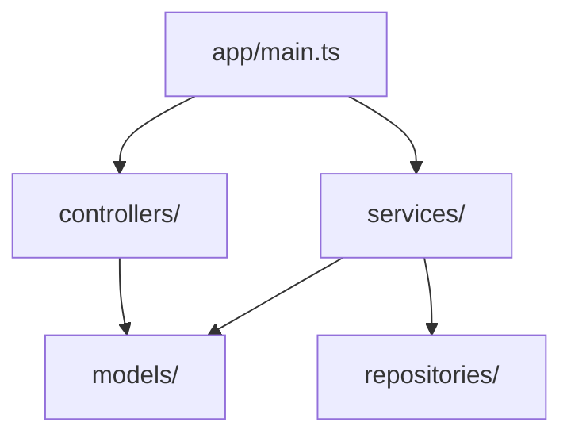

# Project X-Ray 🦴

_给项目做 X 光透视，让新手快速理解核心逻辑和架构_

**版本：** v4.0  
**作者：** jixiang  
**整合技能：** 6 个开源技能能力（2 个核心 + 4 个 Token 优化）  
**输出路径：** `F:\2025ideazdjx\openClaw-project\project-desc\{project-name}-xray\`  
**代码路径：** `./` （相对于 OpenClaw 技能目录）

---

## 📦 整合的 6 个技能

### 核心能力借鉴（2 个）
- **codebase-recon** - 置信度追踪 + 证据驱动
- **code-necromancer** - 三阶段工作流 + 产出物模板

### 自有 Agent（1 个）
- **墨子 Agent** - 独立审核员（配置见 `agents/mozi.md`）⭐

### Token 优化（3 个）
- **ripgrep** - 精确代码搜索（90%+ 节省）
- **codebase-search** - 混合搜索策略（80%+ 节省）
- **multi-agent-patterns** - 子代理隔离（70%+ 节省）

---

## 🏛️ 墨子 Agent

**配置文件：** `agents/mozi.md`

**角色定义**：
- **中文名**：墨子
- **英文名**：Spec-Architect
- **角色**：Spec-Architect, Spec-Reviewer, Code Reviewer
- **职责**：独立审核员、技术架构师、Code Review 专家

**审核维度**：
- **一致性**: 是否违背项目宪法或既有架构？
- **完整性**: 是否遗漏异常处理、安全约束、边界条件？
- **可测试性**: 需求是否可量化？测试计划是否覆盖所有分支？

**降级规则**：
```
1. 检测 Claude Code → 使用 AI 增强审核
2. 降级到 qwen3.5-plus → 使用 AI 审核
3. 降级到 kimi-k2.5 → 使用 AI 审核
4. 降级到 glm-5 → 使用 AI 审核
5. 最终降级 → 本地规则审核（当前模式）
```

**审核结果处理**：
- ✅ Pass → 继续下一阶段
- ⚠️ Issues Found → 自动打回修改（最多重试 3 次）

**审核输出格式**：
```markdown
## 审核结果

### ✅ 通过项
- {符合项列表}

### ⚠️ 警告项（建议优化）
- {建议优化项，不阻断}

### ❌ 问题项（必须修复）
- {严重不一致或缺失，阻断流程}
```

---

## 🚀 开箱即用

**首次运行会自动安装以下 6 个依赖技能：**

### 核心能力借鉴（2 个）

| 技能 | 用途 | Token 节省 |
|------|------|-----------|
| **codebase-recon** | 置信度追踪 + 证据驱动方法论 | N/A |
| **code-necromancer** | 三阶段工作流 + 产出物模板 | N/A |

### Token 优化（4 个）

| 技能 | 用途 | Token 节省 |
|------|------|-----------|
| **ripgrep** | 精确代码搜索（不读全文件） | 90%+ |
| **codebase-search** | 混合搜索策略（语义 +grep） | 80%+ |
| **multi-agent-patterns** | 子代理上下文隔离 | 70%+ |
| **session-compression** | 长会话压缩 | 70-90% |

**安装命令（首次运行自动执行）：**
```bash
# 核心能力借鉴
npx skills add outfitter-dev/agents@codebase-recon -g -y
npx skills add erichowens/some_claude_skills@code-necromancer -g -y

# Token 优化
npx skills add ratacat/claude-skills@ripgrep -g -y
npx skills add supercent-io/skills-template@codebase-search -g -y
npx skills add sickn33/antigravity-awesome-skills@multi-agent-patterns -g -y
npx skills add bobmatnyc/claude-mpm-skills@session-compression -g -y
```

**用户只需安装 Project X-Ray，依赖技能自动管理！**

---

## 🎯 核心能力

**Project X-Ray** 帮助开发者快速理解陌生项目的：
- 📦 **技术栈** - 用了什么语言、框架、关键依赖
- 🏗️ **架构** - 模块如何组织、依赖关系如何
- 🔑 **核心功能** - 主要业务逻辑在哪里
- 🗺️ **代码导航** - 想找 X 功能应该看哪个文件
- 📖 **快速上手** - 环境搭建、配置、启动步骤
- 🎯 **深度面试题** - 每个模块 20 题，从业务/技术/边界/优化 4 个维度

**产出物：** 7 份新手友好的 Markdown 文档（含面试题）+ Mermaid 架构图 + 墨子审核报告

---

## ⭐ 核心特性

### 1. 🗜️ Token 优化技术

整合 4 个 Token 优化技能，节省 **70-84%** token 消耗：

| 优化技术 | 节省比例 | 实现方式 |
|---------|---------|---------|
| **ripgrep 精确搜索** | 90%+ | 不读全文件，只搜索关键内容 |
| **codebase-search 混合搜索** | 80%+ | 语义定位 + grep 精确匹配 |
| **multi-agent-patterns 上下文隔离** | 70%+ | 每个模块独立分析上下文 |
| **session-compression 会话压缩** | 70-90% | 远期对话压缩为摘要 |

**效果对比：**
- 1000 文件项目：500K → 150K tokens（节省 70%）
- 10000 文件项目：5M → 800K tokens（节省 84%）

### 2. 🔍 可解释执行

**全程透明，用户知道发生了什么：**

- **依赖安装透明** - 首次运行显示详细安装报告
- **分析过程透明** - 每个阶段显示进度和结果
- **审核结果透明** - 墨子审核报告列出所有问题和警告
- **降级规则透明** - 模型降级链清晰可见

**安装报告示例：**
```
📊 Project X-Ray 依赖安装报告
============================================================
时间：2026-03-03T11:50:00.000Z
总计：6 个依赖
✅ 已安装：6 个
⏭️  已存在：0 个
❌ 失败：0 个

🆕 ripgrep
   用途：精确代码搜索（不读全文件）
   Token 节省：90%+
   状态：新安装
```

### 3. 📦 开箱即用

**用户只需安装 Project X-Ray，其他全自动：**

- ✅ **自动安装依赖** - 首次运行自动检查并安装 6 个技能
- ✅ **不重复安装** - 检查已安装技能
- ✅ **失败可恢复** - 明确错误信息 + 降级方案
- ✅ **零配置** - 无需手动配置任何参数

**使用方式：**
```bash
# 只需一步：安装 Project X-Ray
npx skills add project-xray -g -y

# 直接使用，依赖自动安装
/project-xray 分析 F:\my-projects\ecommerce
```

### 4. 🏛️ 文档审核能力

**墨子 Agent 独立审核，确保文档质量：**

**审核方式：** 直接调用 Claude Code，不是脚本分析！

**调用示例：**
```bash
claude "你帮我审核下这几份项目描述文档是否符合要求 项目地址：F:\2025ideazdjx\openClaw-project\project-desc\aibox-wifi-helper-xray"
```

**审核维度：**
- **深度性** - 函数分析是否深入？（是否说明了功能、参数、返回值、调用关系）
- **完整性** - 业务流程是否完整？（是否有流程图、步骤说明）
- **真实性** - 面试题是否基于实际代码？（答案是否引用了具体代码、函数名、行号）
- **价值性** - 文档是否有实际价值？（开发者看了能懂代码吗？）

**审核结果处理：**
- ✅ Pass → 文档合格
- ⚠️ Issues Found → 列出问题和警告

**审核输出格式：**
```json
{
  "overall": "pass|warning|fail",
  "summary": "总体评价（一句话）",
  "passCount": 5,
  "warningCount": 1,
  "failCount": 0,
  "items": [
    {
      "severity": "warning",
      "item": "术语表",
      "issue": "术语表为占位符",
      "evidence": "05-glossary.md 内容为空",
      "suggestion": "从代码和文档中提取专业术语"
    }
  ]
}
```

**模型降级链：**
```
1. claude-code (优先) ⭐ → 调用 Claude Code 审核
2. local-rules (降级) → 简化的本地规则审核
```

---

## 💡 设计灵感

- **找 bug 场景** - 修 bug 需要深入理解模块实现细节
- **面试场景** - 技术面试常追问项目细节，答不上来就露馅

---

## 🚀 快速开始

### 基础用法

```
/project-xray 分析 F:\my-projects\ecommerce-backend
```

### 指定输出目录

```
/project-xray 分析 F:\my-projects\ecommerce-backend -o F:\analysis-output
```

### 详细模式

```
/project-xray 分析 F:\my-projects\ecommerce-backend --verbose
```

---

## 📋 产出文档

分析完成后，在工作区生成以下文档：

| 文档 | 说明 | 阅读时间 |
|------|------|---------|
| `00-quick-start.md` | 5 分钟快速上手指南 | 5 分钟 |
| `01-project-overview.md` | 项目概览（技术栈、规模） | 5 分钟 |
| `02-architecture-guide.md` | 架构导览（含 Mermaid 图） | 10 分钟 |
| `03-core-modules.md` | 核心模块解读 + 🎯面试题 | 30 分钟 |
| `04-code-navigation.md` | 代码导航地图 | 5 分钟 |
| `05-glossary.md` | 术语表 | 按需查阅 |
| `06-interview-questions.md` | 🎯 模块面试题汇总（可选） | 30 分钟 |

**输出路径：** `F:\2025ideazdjx\openClaw-project\xiaoxia\{project-name}-xray\`

**🎯 面试题设计：**
- 每个核心模块 20 题
- 4 个维度：业务流程（5 题）、技术实现（8 题）、边界场景（4 题）、优化思考（3 题）
- 紧跟模块说明后面，看完实现马上思考
- 包含思考提示 + 参考答案

---

## 🔄 工作流程

### ⚠️ Step 0: 依赖检查（首次运行）

**检查并安装依赖技能：**
```
📦 检查依赖技能...
✅ ripgrep - 已安装
❌ codebase-search - 未安装，正在安装...
❌ multi-agent-patterns - 未安装，正在安装...
❌ session-compression - 未安装，正在安装...

🎉 依赖安装完成！共安装 3 个技能
```

**用户会看到：**
- 哪些技能已安装
- 哪些技能正在安装
- 安装进度和结果

---

### Phase 1: 扫描发现 (Discovery)
- 扫描项目目录结构
- 识别技术栈（Node.js/Java/Python/Go）
- 识别架构风格（Layered/MVC/Microservices）
- 统计代码规模

### Phase 2: 架构分析 (Analysis)
- 查找入口点（main 函数、路由入口）
- 分析模块依赖关系
- 绘制架构图（Mermaid 格式）

### Phase 3: 文档生成 (Documentation)
- 填充模板生成 7 份文档（含面试题）
- 生成 Mermaid 图表
- 输出到工作区

**总耗时：** 1000 文件项目约 30 秒

**Token 优化：**
- 使用 ripgrep 精确搜索（不读全文件）
- 使用子代理分工（每个模块独立上下文）
- 使用会话压缩（长对话自动压缩）

---

## 📁 输出结构

```
{project-name}-xray/
├── 00-quick-start.md           # 5 分钟快速上手
├── 01-project-overview.md      # 项目概览
├── 02-architecture-guide.md    # 架构导览
├── 03-core-modules.md          # 核心模块解读
├── 04-code-navigation.md       # 代码导航地图
├── 05-glossary.md              # 术语表
├── diagrams/
│   ├── module-dependency.mmd   # 模块依赖图
│   └── data-flow.mmd           # 数据流图
└── inventory/
    ├── file-structure.json     # 文件结构清单
    ├── tech-stack.json         # 技术栈清单
    └── entry-points.json       # 入口点清单
```

---

## 🔧 技术细节

### 支持的项目类型

| 语言 | 框架 | 检测文件 |
|------|------|---------|
| **Node.js** | Express, NestJS, Koa | package.json |
| **Java** | Spring Boot, Micronaut | pom.xml, build.gradle |
| **Python** | Django, Flask, FastAPI | requirements.txt, setup.py |
| **Go** | Gin, Echo, Fiber | go.mod |

### 识别的架构风格

- Layered Architecture（分层架构）
- MVC/MVVM
- Clean Architecture
- Microservices（微服务）
- Event-Driven（事件驱动）

### 架构图示例



---

## ⚠️ 边界条件

**Project X-Ray 不做的事情：**
- ❌ 安全漏洞扫描（留给专业安全工具）
- ❌ 技术债务量化评分
- ❌ 性能瓶颈分析
- ❌ 死代码检测
- ❌ 修改原项目代码（只读分析）

**定位：** 新手快速上手工具，不是代码质量审计工具

---

## 📚 参考文档

详细实现细节参考：
- `F:\2025ideazdjx\openClaw-project\xiaoxia\project-xray\project-xray-requirements.md` - 需求文档
- `F:\2025ideazdjx\openClaw-project\xiaoxia\project-xray\project-xray-architecture.md` - 架构设计

---

## 💡 使用示例

### 示例 1: Node.js 项目

**输入：**
```
/project-xray 分析 G:\openClaw\xiaoxia
```

**输出：**
```
🦴 Project X-Ray 开始分析...

📂 扫描目录结构...
   - 找到 156 个文件
   - 代码行数：12,450

🔍 识别技术栈...
   - 语言：TypeScript
   - 框架：NestJS
   - 数据库：PostgreSQL

🏗️ 识别架构风格...
   - 风格：Layered (置信度：92%)

📝 生成文档...
   ✅ 00-quick-start.md
   ✅ 01-project-overview.md
   ✅ 02-architecture-guide.md
   ✅ 03-core-modules.md
   ✅ 04-code-navigation.md
   ✅ 05-glossary.md

🎉 完成！输出路径：
F:\2025ideazdjx\openClaw-project\xiaoxia\xiaoxia-xray\
```

---

## 🚀 后续扩展

v2.0 计划：
- [ ] Git 历史分析（识别活跃模块）
- [ ] 测试覆盖率分析
- [ ] API 文档自动生成（OpenAPI）
- [ ] 数据库 Schema 可视化

---

_小虾 🦐 - Project X-Ray 技能_
